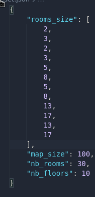
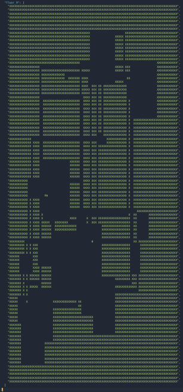

# generateur-donjon

Générateur procédural de donjons réalisé dans le cadre du projet my_rpg.

Pour lancer le générateure faites ./generator [nom_du_fichier_json]

Le générateur prends en paramètre un fichier json contenant toutes les infos concernant le donjon souhaité.  
Les options sont : 

  - La taille (largeur et hauteur) minimum et maximum des trois types de salles (petites, moyennes et grandes)

  - La taille globale de la carte

  - Le nombre de salles voulues

  - Le nombre d'étages désirés.

Vous pourrez trouver quelques résultats dans le sous dossier results ou ici:

